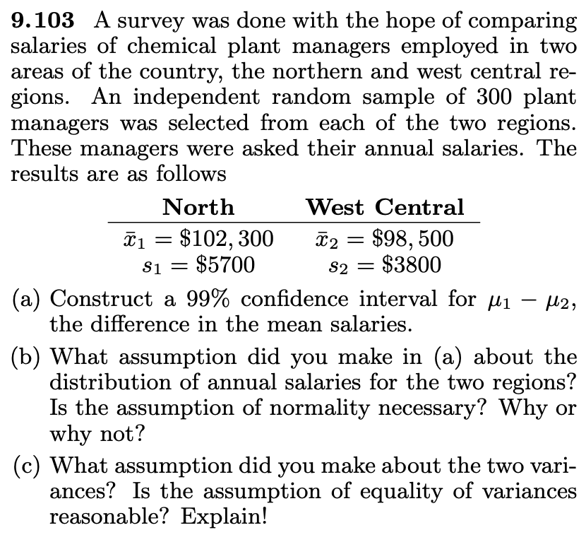
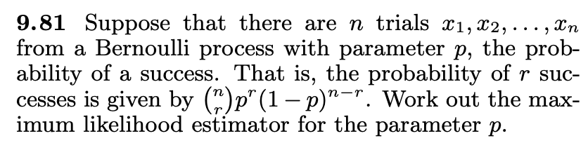
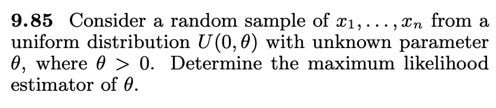

---
output:
  html_document: default
  pdf_document: default
---
# MathStat474 - HW 11

> Posted Nov 5. **Due: WED Nov 12.** 

Remember to always explain your answers. 

### Problem 1. [this is about conficendce intervals and margin of error]

* What sample size of U.S. adults do you need, if you would like to estimate the proportion of U.S. adults who are "pro-choice" with a 2.5% margin of error (at the 95% level)?
* Your answer to the above question indicates that if you take a sample of that size, the sample proportion of adults who are pro-choice is (select one):
    * more than 2.5% away from the proportion who are pro-choice among all U.S. adults.
    * within 2.5% of the proportion who are pro-choice among all U.S. adults.
    * exactly equal to the proportion who are pro-choice among all U.S. adults.
    
* If you were to use a random sample of size n = 640 U.S. adults (instead of what you found in question 1), what would the margin of error roughly be?
    * 4%
    * .156%
    * 3%
    * 5% 

### Problem 2. [problem 9.37 in the book]

A study was conducted to determine if a certain treatment has any effect on the amount of metal removed in a pickling operation. A random sample of 100 pieces was immersed in a bath for 24 hours without the treatment, yielding an average of 12.2 millimeters of metal removed and a sample standard deviation of 1.1 millimeters. A second sample of 200 pieces was exposed to the treatment, followed by the 24-hour immersion in the bath, resulting in an average removal of 9.1 millimeters of metal with a sample standard deviation of 0.9 millimeter. Compute a 98% confidence interval estimate for the difference between the population means. Does the treatment appear to reduce the mean amount of metal removed?

### Problem 3. [problem 9.41 in the book]

The following data represent the length of time, in days, to recovery for patients randomly treated with one of two medications to clear up severe bladder infections:

| Medication 1: | Medication 2:  | $\quad$ | $\quad$ |$\quad$ |$\quad$ |$\quad$ |
| ---- |  ---- | ----|----|----|----|----|
| $n_1=14$ | $n_2=16$ ||||||
| $\bar{x_1}=17$ | $\bar{x_2}=19$ | |||||
| $s_1^2=1.5$ | $s_2^2=1.8$ | |||||

Find a 99% confidence interval for the difference $\mu_2-\mu_1$ in the mean recovery times for the two medications, assuming normal populations with equal variances.

### Problem 4.   [problem 9.104 in the book]

Consider Review Exercise 9.103. Let us assume that the data have not been collected yet and that previous statistics suggest that σ1 = σ2 = \$4000. Are the sample sizes in Review Exercise 9.103 sufficient to produce a 95% confidence interval on $\mu_1=\mu_2$ having a width of only \$1000? Show all work.

{ width=40% }

### Problem 5 [Extra credit] 
Choose either problem 9.81 or 9.85 from the book: 

9.81. asks for an MLE for $p$ in a Bernoulli process; 9.85 asks for an MLE for $\theta$ in a uniform distribution. 

{ width=40% } 
{ width=40% } 

---

---

### Typing up work 

If you *want* to type up your homework, please don't use Microsoft Word or the like. You can get great formatted documents in Markdown! Check out the links below. 

Get familiar with professionally formatting documents using Markdown [here](https://sondzus.github.io/MathStat474/DocumentFormattingGuidelines.html). 
Want more information? Simple .md templates for PDF documents are available [here](https://sondzus.github.io/MathStat474/DocumentFormattingGuidelines.html). 

