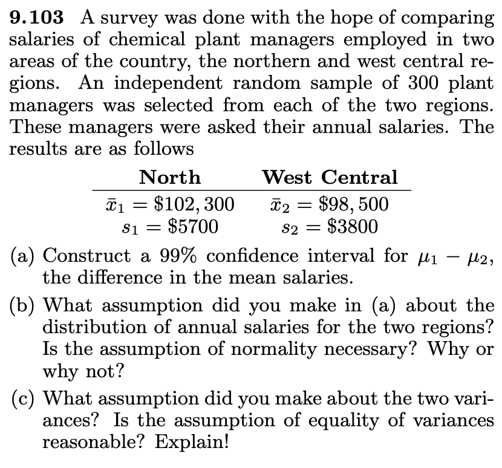

---
output:
  html_document: default
  pdf_document: default
---
# MathStat474 - HW 11

> Posted April 23. **Due: Tue April 28 for early grading, or Thu April 30.** 

Remember to always explain your answers. 

### Problem 1. [Random sampling conditions for hypothesis testing.]

We plan to poll 200 students enrolled in statistics at your college by distributing surveys during class. Which of the following hypotheses could be tested with the survey results? Mark each as valid (OK to use to test the hypothesis) or not valid (should not be used to test the hypothesis). Of course, explain why valid/invalid! 

* The hypothesis that p = 0.60, where p is the proportion of students at your college who study the recommended “2 hours a week for each class unit.”

* The hypothesis that p = 0.60, where p is the proportion of students at your college who visit a dentist at least once a year.

* The hypothesis that p = 0.60, where p is the proportion of students at your college who are receiving some form of financial aid.

* The hypothesis that p = 0.60, where p is the proportion of students at your college who spend more than $600 per semester on textbooks.

### Problem 2. [conditions for using the z-test for population proportion]

In each of the following scenarios, you need to decide whether it is appropriate to use the z-test for the population proportion p, and if not, which condition is violated.

*Scenario 1:* The UCLA Internet Report (February 2003) estimated that roughly 8.7% of Internet users are extremely concerned about credit card fraud when buying online. Has that figure changed since? To test this, a random sample of 100 Internet users was chosen. When interviewed, 10 said that they were extremely worried about credit card fraud when buying online. Let p be the proportion of all Internet users who are concerned about credit card fraud.

Which one of the following statements is correct about using the z-test for p?

* It is safe to use the z-test for p.
* It is not safe to use the z-test for p, since the sample is not a random sample from the entire population (or cannot be considered as one).
* It is not safe to use the z-test for p since $n  p_0$ is not large enough.
* It is not safe to use the z-test for p since $n(1 - p_0)$ is not large enough.

*Scenario 2:* The UCLA Internet Report (February 2003) estimated that a proportion of roughly .75 of Internet-using homes are still using dial-up access, but claimed that the use of dial-up is declining. Is that really the case? To examine this, a follow-up study was conducted a year later in which out of a random sample of 1,308 households that had an Internet connection, 804 were connecting using a dial-up modem. Let p be the proportion of all U.S. Internet-using households that have dial-up access.

Which one of the following statements is correct about using the z-test for p?

* It is safe to use the z-test for p.
* It is not safe to use the z-test for p, since the sample is not a random sample from the entire population (or cannot be considered as one).
* It is not safe to use the z-test for p since $n  p_0$ is not large enough.
* It is not safe to use the z-test for p since $n(1 - p_0)$ is not large enough.

### Problem 3. [p-value and complete testing setup]

We would like to find out the following: 
Has the proportion of U.S. adults who support the death penalty for convicted murderers changed since 2003, when it was 0.64? 
We take a random sample of 1000 US adults and learn that 675 are in favor of the death penalty for convicted murderers. 

* What is the population parameter we are testing? 
* Set up the null and alternative hypothesis.
* State the test statistic (formula) and compute the observed value of the test statistic.
* Compute the $p$-value of this data. 
* Draw your conclusion. 

## Setup for problems 4 & 5.

College students at a large state university completed a survey about their academic and personal life. Questions ranged from "How many credits are you registered for this semester?" to "Would you define yourself as a vegetarian?" Four sections of an introductory statistics course were chosen at random from all the sections of introductory statistics courses offered at the university in the semester when the survey was conducted, and the 312 students who completed the survey were students registered in one of the four chosen sections.

In this exercise, we will use a subset of variables from the survey and use the collected data to answer three questions. Note that (1) these are real data, and (2) the symbol *  means that this observation is not available (this is known as a "missing value").

Here are the variables in the data and their meaning: 

* **Math**:  Math  SAT score 
* **Verbal**: Verbal SAT score
* **Credits**: Number of credits the student is registered for
* **Year**: Year in college (1=Freshman, 2=Sophomore, 3=Junior, 4=Senior)
* **Exer**: Time (in minutes) spent exercising in a typical day
* **Sleep**: Time (in hours) spent sleeping in a typical day
* **Veg**: Are you a vegetarian (yes, no, some)
* **Cell**: Do you own a cell phone (yes, no)

### Problem 4. [Understand the data]

We will start by answering some questions about the data.

* Out of the first ten students in the datafile, how many did better on the verbal portion of the SAT compared to the math portion?

* Out of the first ten students in the datafile, how many are at least somewhat vegetarian?

* How many hours does the first junior in the datafile who does not own a cell phone spend sleeping in a typical day?

* The next step in understanding the problem is addressing the issues of sampling and study design, which have implications on the generalizability of the results and the type of conclusions you can draw from them. 
  * Is this an observational study or an experiment? 
  * Briefly describe what the problem statement tells us about how the individuals in the dataset were selected to be in the sample.

### Problem 5, option A. [You have 3 options to choose from; solve A or B or C.]

The mean verbal SAT score of all the students in this university is 580. Is this also the case for all stat students at this university? Note that verbal SAT scores in the U.S. have a standard deviation of 111.

* Identify which of the variables in the sample are relevant to each question. 
* What population parameter are you exploring? 
* What is the relevant statistic for this parameter? 
* Which test will you use and why? 
* Complete the computation. 

### Problem 5, option B. [You have 3 options to choose from; solve A or B or C.]

Based on a recent study, roughly 80% of college students in the U.S. own a cell phone. Do the data provide evidence that the proportion of students who own cell phones in this university is lower than the national figure?

* Identify which of the variables in the sample are relevant to each question. 
* What population parameter are you exploring? 
* What is the relevant statistic for this parameter? 
* Which test will you use and why? 
* Complete the computation. 

### Problem 5, option C. [You have 3 options to choose from; solve A or B or C.]

Adults in the U.S. average 7 hours of sleep a night. Is this also the mean for all stat students at this university?

* Identify which of the variables in the sample are relevant to each question. 
* What population parameter are you exploring? 
* What is the relevant statistic for this parameter? 
* Which test will you use and why? 
* Complete the computation. 

<!-- 
### Problem 1. [we had no HW for difference in means. so... make a question about hypotehsis test for diff means.]

ACTUALLY COPY PROBLMES FROM oldHW12.HTML!!! 

then, oldHW13.html can be an excellet REVIEW PROBLEM! 

### Problem 2. 

A study was conducted to determine if a certain treatment has any effect on the amount of metal removed in a pickling operation. A random sample of 100 pieces was immersed in a bath for 24 hours without the treatment, yielding an average of 12.2 millimeters of metal removed and a sample standard deviation of 1.1 millimeters. A second sample of 200 pieces was exposed to the treatment, followed by the 24-hour immersion in the bath, resulting in an average removal of 9.1 millimeters of metal with a sample standard deviation of 0.9 millimeter. Compute a 98% confidence interval estimate for the difference between the population means. Does the treatment appear to reduce the mean amount of metal removed?

### Problem 3. [diff means CI! ]

The following data represent the length of time, in days, to recovery for patients randomly treated with one of two medications to clear up severe bladder infections:

| Medication 1: | Medication 2:  | $\quad$ | $\quad$ |$\quad$ |$\quad$ |$\quad$ |
| ---- |  ---- | ----|----|----|----|----|
| $n_1=14$ | $n_2=16$ ||||||
| $\bar{x_1}=17$ | $\bar{x_2}=19$ | |||||
| $s_1^2=1.5$ | $s_2^2=1.8$ | |||||

Find a 99% confidence interval for the difference $\mu_2-\mu_1$ in the mean recovery times for the two medications, assuming normal populations with equal variances.

### Problem 4.   diff in vairances... another conf. int. NO 

Consider Review Exercise 9.103. Let us assume that the data have not been collected yet and that previous statistics suggest that σ1 = σ2 = \$4000. Are the sample sizes in Review Exercise 9.103 sufficient to produce a 95% confidence interval on $\mu_1=\mu_2$ having a width of only \$1000? Show all work.

{ width=40% }

### Problem 5 

--> 

---

---

### Typing up work 

If you *want* to type up your homework, please don't use Microsoft Word or the like. You can get great formatted documents in Markdown! Check out the links below. 

Get familiar with professionally formatting documents using Markdown [here](https://sondzus.github.io/MathStat474/DocumentFormattingGuidelines.html). 
Want more information? Simple .md templates for PDF documents are available [here](https://sondzus.github.io/MathStat474/DocumentFormattingGuidelines.html). 

