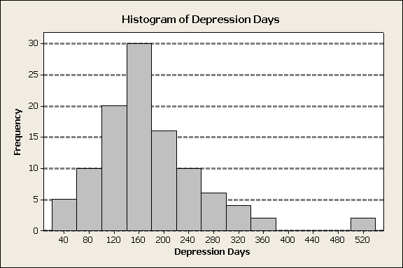

# MathStat474 - HW 2 

> Posted: Wed Jan 17. **Due: Wed Jan 24.** 

## Problem 1

 Solve exercise 1.2 in the textbook

## Problem 2.

Solve exercise 1.3 in the textbook. 

## Problem 3. 

Compute the range of the data, sample variance, and sample standard deviation in exercises 1.2. 

## Problem 4.

Solve exercise 1.9 in the textbook. 

## Problem 5. 

This problem is about visualization of distributions & interpretation of histograms.

In the workplace, depression is a leading cause of absenteeism and loss of productivity (Greenberg, et al. 1993). To assess the degree to which people suffer from depression, prior to receiving treatment, data were collected on the number of days that 105 patients were depressed prior to starting a new treatment. These data are displayed in the following table and histogram:

|Days|Count| 
|-----------|----|
| [20–60]   | 5  |   
| [60–100]  | 10 |   
| [100–140] | 20 |   
| [140–180] | 30 |   
| [180–220] | 16 |   
| [220–260] | 10 |   
| [260–300] | 6  |   
| [300–340] | 4  |   
| [340–380] | 2  |  
| [380–420] | 0  |   
| [420–460] | 0  |   
| [460–500] | 0  |   
| [500–540] | 2  |   

 

*  Which of the following is a possible value of the median number of days that patients were depressed? **Explain your answer.** 
  
  a. 53
  b. 170
  c. 220
  d. 290 
  
* Using this same histogram of 105 patients, which of the following is most likely to be true? **Explain your answer.** 
  
  a. The mean will be larger than the median.
  b. The median will be larger than the mean.
  c. The mean and median will be about the same.

* Using this same histogram of 105 patients, what percentage of patients had 220 or more days of depression? **Explain your answer.** 
  
  a. 13
  b. 23
  c. 24
  
---

### Related readings

Please note, the textbook introduces **trimmed mean**, which we did not compute in the lecture as of Week 2. Please do study that concept from the textbook! 

---

---

### Typing up work 

If you want to type up your homework, please don't use Microsoft Word or the like. You can get great formatted documents in Markdown! Check out the links below. 

Get familiar with professionally formatting documents using Markdown [here](https://sondzus.github.io/MathStat474/DocumentFormattingGuidelines.html). 
Want more information? Simple .md templates for PDF documents are available [here](https://sondzus.github.io/MathStat474/DocumentFormattingGuidelines.html). 

