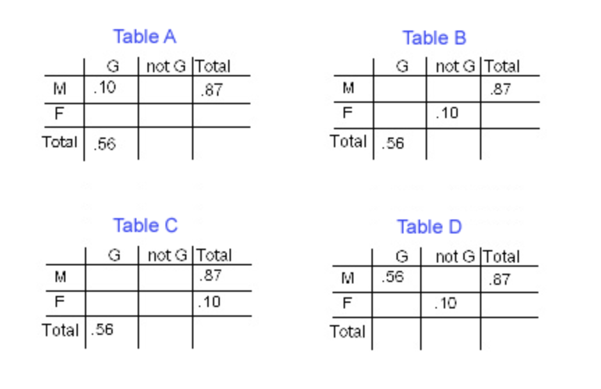

---
output:
  html_document: default
  pdf_document: default
---
# MathStat474 - HW 4

> Posted: Wed Sep 10. **Due: Wed Sep 17.** 

Notation: Please notice that our textbook uses the notation $A'$ for the complement of the event $A$. So when it writes $P(A')$, they mean $P(\mbox{not }A)$.

### Problem 1.

<!-- Solve exercise **2.46** in the textbook. (Counting outcomes: combinations and permutations.) 
Solve exercise **2.47** in the textbook. (Counting outcomes: combinations and permutations.) 
Solve exercise **2.48** in the textbook. (Counting outcomes: combinations and permutations.) 
--> 

According to www.jointogether.com, in 2000, 87% of all suicides were committed by males, 56% of all suicides were
committed using a gun, and 10% of all suicides were committed by women not using a gun.
(We'll use M for suicide committed by a male, F[= not M] for suicide committed by female, and G for a suicide
committed using a gun.)
Which of the following is a correct representation of the given information in a two-way probability table?

{ width=50% }

### Problem 2. 

<!-- Complete the entire two-way probability table starting with the information displayed in the correct answer to the previous question. Your answer table should have all 9 enries populated. 

### Problem 3.
--> 

Researchers studied thousands of court cases. For each case, they recorded the jury's decision. In addition, they asked
the judge in each case how he or she would have decided the same case if there were no jury. In 67% of the cases the jury
voted to convict, in 83% of the cases the judge would have convicted, and in 19% of the cases only the judge would have
convicted.
Let A be the event "jury convicts"
Let B be the event "judge convicts".

Complete the two-way probability table of the same format as in the previous problem! 

<!-- 
\begin{table}[]
\begin{tabular}{|l|l|l|l|l|}
\hline
B & not B & Total &       &  \\ \hline
  &       &       & A     &  \\ \hline
  &       &       & Not A &  \\ \hline
  &       &       & Total &  \\ \hline
\end{tabular}
\end{table}
--> 

### Problem 3.

 Solve exercise **2.58** in the textbook. (Compute some probabilities when rolling a pair of dice.) 

A pair of fair dice is tossed. Find the probability of getting: 

(a) a total of 8;
(b) at most a total of 5.

### Problem 4. 

Solve exercise **2.72** in the textbook. (Prove a certain equality of probabilities!) 

Prove that

$$ P(A'\cap B′)=1+P(A\cap B)-P(A)-P(B). $$

---

---

### Typing up work 

If you *want* to type up your homework, I suggest you don't use Microsoft Word or the like. You can get great formatted documents in Markdown! Check out the links below. 
But whatever you use, please make sure your submission is either a PDF document, a photo of the document, or a nicely formatted text document. 

Get familiar with professionally formatting documents using Markdown [here](https://sondzus.github.io/MathStat474/DocumentFormattingGuidelines.html). 
Want more information? Simple .md templates for PDF documents are available [here](https://sondzus.github.io/MathStat474/DocumentFormattingGuidelines.html). 

