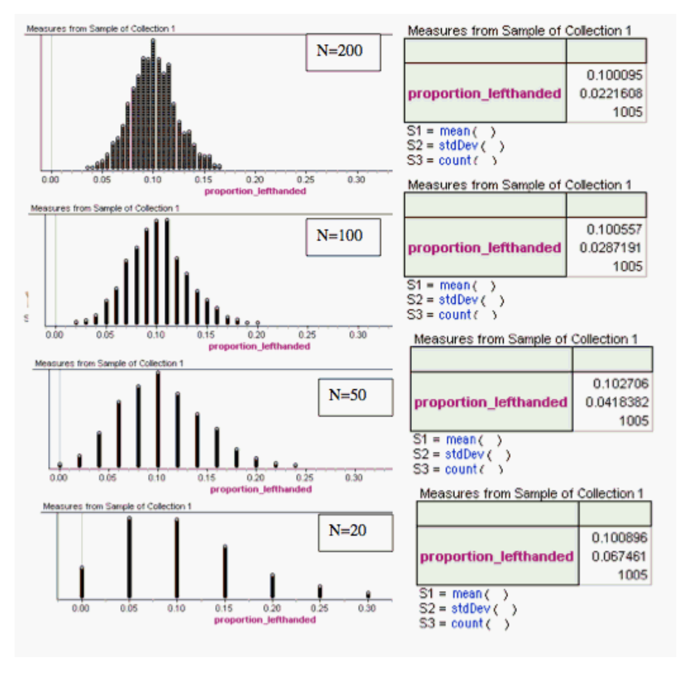

---
output:
  html_document: default
  pdf_document: default
---
# MathStat474 - HW 9

> Posted by Oct 22. **Due: WED Oct 29.** 

### Problem 1. 

This problem is about sampling distribution of the sample proportion.

The proportion of left-handed people in the general population is about 0.10. To simulate this population, we construction a collection in which $p=0.10$. We then conducted four simulations, drawing random samples of different sizes from this collection. 

Below are the resulting sampling distributions and corresponding summary tables: 

{ width=50% }

Explain how these simulations illustrate the theory we learned about the behaviour of sample proportions. Make sure you address:

* whether the approximate model is appropriate
* skewness and behavior as sample size increases
* center and spread of the sampling distributions. 

### Problem 2. 

This problem is for practicing to recognize the three types of statistical inference: point estimation, interval estimation, and hypothesis testing. 

a. A recent poll asked a random sample of 1,100 U.S. adults whether or not they support gay marriage. Based on the results of the poll, the pollsters estimated that the proportion of all U.S. adults who support gay marriage is 0.61. Which form of statistical inference should you use to evaluate this conclusion? 

b. A blurb on a box of brand X lightbulbs claimed that the mean lifetime of each lightbulb is 750 hours. A random sample of 36 light bulbs was tested in a laboratory, and it was found that their average lifetime is 745 hours. Which form of statistical inference should you use to evaluate whether the data provide enough evidence against the advertised mean lifetime on the box?

c. Based on data collected from a random sample of 1,200 college freshmen, researchers are 95% confident that the mean number of sleep hours of all college freshmen is between 6 hours and 7.5 hours. Which form of statistical inference should you use to evaluate this conclusion? 

### Problem 3. 

Scores on the math portion of the SAT (SAT-M) in a recent year have followed a normal distribution with mean $\mu$ = 507 and standard deviation $\sigma$ = 111.

What is the probability that the mean SAT-M score of a random sample of 4 students who took the test that year is more than 600? 
Explain why you can solve this problem, even though the sample size (n = 4) is very low.

### Problem 4.
The annual salary of teachers in a certain state X has a mean of  $54,000$ and standard deviation of $\sigma=5,000$. 

a. What is the probability that the mean annual salary of a random sample of 5 teachers from this state is more than $60,000? Find this probability or explain why you cannot.

b. What is the probability that the mean annual salary of a random sample of 64 teachers from this state is less than $52,000?

While answering this question, clearly state the mean and standard deviation of the sampling distribution of the sample means, and the z-score for the problem. 

### Problem 5.
Solve exercises 8.18 and 8.19.a) from the textbook:

* If the standard deviation of the mean for the sampling distribution of random samples of size 36 from a large or infinite population is 2, how large must the sample size become if the standard deviation is to be reduced to 1.2?
* A certain type of thread is manufactured with a mean tensile strength of 78.3 kilograms and a standard deviation of 5.6 kilograms. How is the variance of the sample mean changed when the sample size is increased from 64 to 196?

### Problem 6 - EXTRA CREDIT 
**up to 10 points for a complete proof, no credit for partial answer**

Derive the sampling distribution of the difference of sample proportions for two samples.  

In other words, for population 1 let the  proportion parameter be $p_1$, and for population 2 let the proportion parameter be $p_2$. We are interested in the sampling distribution of $\hat p_1 - \hat p_2$, where $\hat p_1$ and $\hat p_2$ are sample proportions for two samples, one from each population. 

* Hint: Use the "reproductive property" of the normal distribution, which states that a sum of normals is normal; we stated this in class and it is found, for example, on page 233 (section 8.4) of the textbook. 

---

---

### Typing up work 

If you *want* to type up your homework, please don't use Microsoft Word or the like. You can get great formatted documents in Markdown! Check out the links below. 

Get familiar with professionally formatting documents using Markdown [here](https://sondzus.github.io/MathStat474/DocumentFormattingGuidelines.html). 
Want more information? Simple .md templates for PDF documents are available [here](https://sondzus.github.io/MathStat474/DocumentFormattingGuidelines.html). 

