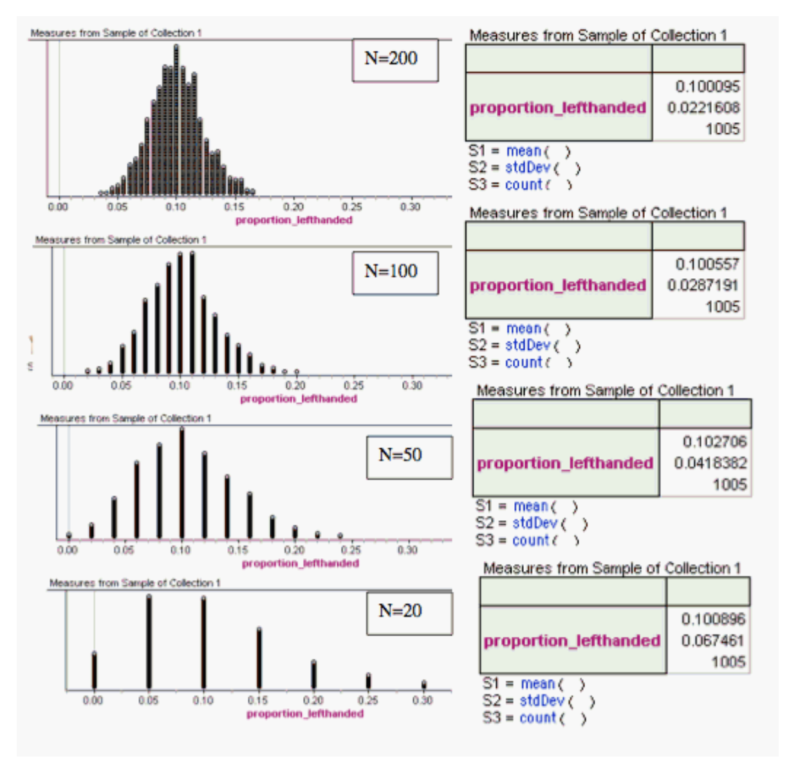

---
output:
  html_document: default
  pdf_document: default
---
# MathStat474 - HW 9

> Posted on April 6.  **Due: Thu Apr 16.** 

### Problem 1: Sampling Distribution of the Sample Proportion

This problem is about the **sampling distribution of the sample proportion**.

The proportion of left‑handed people in the general population is approximately $0.10$. 
To simulate this population, we construct a collection in which the probability of selecting a left‑handed individual is \( p = 0.10 \).
We then conduct **four simulations**, each consisting of drawing random samples of different sizes from this population.

Below are the resulting **sampling distributions of the sample proportion** along with their corresponding summary tables.

Explain how these simulations illustrate the theory we learned about the behaviour of sample proportions. Make sure you address:

* whether the approximate model is appropriate
* skewness and behavior as sample size increases
* center and spread of the sampling distributions.

### Problem 2: recongizning 3 types of statistical inference! 

This problem is for practicing to recognize the three types of statistical inference: point estimation, interval estimation, and hypothesis testing.

a. A recent poll asked a random sample of 1,100 U.S. adults whether or not they support gay marriage. Based on the results of the poll, the pollsters estimated that the proportion of all U.S. adults who support gay marriage is 0.61. Which form of statistical inference should you use to evaluate this conclusion?

b. A blurb on a box of brand X lightbulbs claimed that the mean lifetime of each lightbulb is 750 hours. A random sample of 36 light bulbs was tested in a laboratory, and it was found that their average lifetime is 745 hours. Which form of statistical inference should you use to evaluate whether the data provide enough evidence against the advertised mean lifetime on the box?

c. Based on data collected from a random sample of 1,200 college freshmen, researchers are 95% confident that the mean number of sleep hours of all college freshmen is between 6 hours and 7.5 hours. Which form of statistical inference should you use to evaluate this conclusion?

### Problem 3: sampling distirbution of mean 
Scores on the math portion of the SAT (SAT-M) in a recent year have followed a normal distribution with mean $\mu= 507$ and standard deviation $\sigma =111$. 

What is the probability that the mean SAT-M score of a random sample of 4 students who took the test that year is more than 600? Explain why you can solve this problem, even though the sample size (n = 4) is very low.

### Problem 4: sampling distribution of mean 
The annual salary of teachers in a certain state X has a mean of 54,000 and standard deviation of $\sigma=5000$. 

a) What is the probability that the mean annual salary of a random sample of 5 teachers from this state is more than $60,000? Find this probability or explain why you cannot.
b) What is the probability that the mean annual salary of a random sample of 64 teachers from this state is less than $52,000?

While answering this question, clearly state the mean and standard deviation of the sampling distribution of the sample means, and the z-score for the problem.

### Problem 5: jointly distributed random variables! 

Solve the following parts of exercise 6.10.34. 

Based on the number of voids, a ferrite slab is classified as either high, medium, or low. Historically, 5%
 of the slabs are classified as high, 85%
 as medium, and 10%
 as low. A group of 20 slabs that are independent regarding voids is selected for testing. Let $X$
, $Y$
, and $Z$  
 denote the number of slabs that are classified as high, medium, and low, respectively.
 
a) What are the name and the values of the parameters of the joint probability distribution of  $X$, $Y$, and $Z$? 
b) What is the range of the joint probability distribution of  $X$, $Y$, and $Z$? 
c) What are the name and the values of the parameters of the marginal probability distribution of $X$? 
d) Determine $E[X]$ and $V(X)$.
f) 
Determine $P(X\leq 1,Y=17,Z=3)$.
i) Determine $P(X=2,Z=3|Y=17)$.
k) Determine $E[X|Y=17]$. 